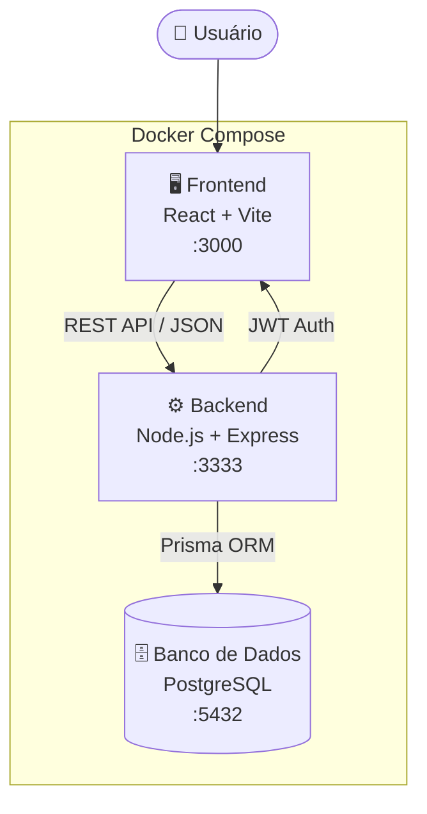

<div align="center">


<br/>

[](https://git.io/typing-svg)

<br/>

[](https://choosealicense.com/licenses/mit/)
[](https://react.dev/)
[](https://www.typescriptlang.org/)
[](https://nodejs.org/)
[](https://www.postgresql.org/)
[](https://www.docker.com/)

<br/>

[](https://trello.com/b/TtUCzMT8/3dsm-abpsprint-1)

</div>

---

## Sobre o Projeto

> **DevFlow** é uma plataforma desenvolvida para centralizar, gerenciar e analisar os leads comerciais da **1000 Valle Multimarcas**, revendedora de veículos com múltiplas unidades, em parceria com a **FATEC Jacareí**.

O sistema integra dados de diferentes canais de captação — presenciais e digitais — em uma única interface, entregando visibilidade total do funil de vendas para todos os níveis hierárquicos da empresa.

---

## Números do Projeto

<div align="center">

| 📦 Módulos | 🔐 Perfis de Acesso | 🔗 Endpoints REST | 🐳 Containers Docker | 🗃️ Tabelas no Banco |
|:---:|:---:|:---:|:---:|:---:|
| **7** | **4** | **+25** | **3** | **10** |

</div>

---

## Screenshots

> 🖥️ As telas do sistema (Login, Dashboard, Leads, Detalhes do Lead e Logs) podem ser visualizadas executando o projeto com `docker compose up` — veja a seção [Como Executar](#como-executar). Os diagramas de casos de uso, classes e sequência estão na seção [Modelagem UML](#modelagem-uml).

---

## Arquitetura



---

## Funcionalidades

<div align="center">

| 🔐 Controle de Acesso | 📋 Gestão de Leads | 🤝 Negociações |
|:---:|:---:|:---:|
| JWT + perfis hierárquicos | Registro e acompanhamento completo | Ciclo com histórico de estágios |
| **📊 Dashboard Operacional** | **📈 Dashboard Analítico** | **🔍 Filtros Temporais** |
| KPIs por status, origem e loja | Taxa de conversão e desempenho | Semana, mês, ano ou customizado |
| **📁 Logs de Auditoria** | **🏢 Multi-lojas** | **👥 Multi-equipes** |
| Rastreabilidade total de ações | Suporte a múltiplas unidades | Gestão por times e gerentes |

</div>

---

## Stack Tecnológica

<div align="center">

### Front-End
&nbsp;
&nbsp;
&nbsp;


### Back-End
&nbsp;
&nbsp;


### Banco de Dados & ORM
&nbsp;


### Infraestrutura & Ferramentas
&nbsp;
&nbsp;
&nbsp;


</div>

---

## Estrutura do Projeto

<details>
<summary><b>Ver estrutura de pastas</b></summary>
<br>

```
prj_3dsm/
├── 🖥️ FRONTEND/
│   ├── src/
│   │   ├── components/       # Componentes reutilizáveis (Header, KpiCard, LeadsTable...)
│   │   ├── pages/            # Páginas da aplicação (Dashboard, Leads, Login...)
│   │   │   ├── Dashboard/
│   │   │   ├── Leads/
│   │   │   ├── LeadDetails/
│   │   │   ├── Logs/
│   │   │   └── ...
│   │   ├── hooks/            # Custom hooks (useLeads, useLojas, useAuth...)
│   │   ├── services/         # Serviços e interfaces de API
│   │   ├── context/          # Contextos React (AuthContext)
│   │   ├── types/            # Tipagens TypeScript globais
│   │   └── utils/            # Utilitários (dateUtils, settings...)
│   ├── Dockerfile
│   └── package.json
│
├── ⚙️ BACKEND/
│   ├── src/
│   │   ├── modules/          # Módulos da aplicação
│   │   │   ├── auth/         # Autenticação e usuários
│   │   │   ├── leads/        # Leads e negociações
│   │   │   ├── dashboard/    # Métricas e KPIs
│   │   │   ├── clientes/     # Clientes
│   │   │   ├── equipes/      # Equipes
│   │   │   ├── lojas/        # Lojas
│   │   │   └── logs/         # Auditoria
│   │   ├── shared/           # Middlewares, rotas, utilitários
│   │   └── domain/           # Modelos de domínio
│   ├── prisma/
│   │   ├── schema.prisma     # Esquema do banco de dados
│   │   ├── migrations/       # Histórico de migrações
│   │   └── seed.ts           # Dados iniciais
│   ├── Dockerfile
│   └── package.json
│
└── 🐳 docker-compose.yml
```

</details>

---

## Como Executar

<details>
<summary><b>Pré-requisitos</b></summary>
<br>

- [Docker](https://www.docker.com/) e Docker Compose instalados
- [Git](https://git-scm.com/) instalado

</details>

<details>
<summary><b>Passo a passo</b></summary>
<br>

```bash
# 1. Clone o repositório
git clone https://github.com/prjDevflow/prj_3dsm.git
cd prj_3dsm

# 2. Suba todos os containers
docker compose up -d

# 3. Acesse a aplicação
# Frontend → http://localhost:3000
# Backend  → http://localhost:3333
# Swagger  → http://localhost:3333/api-docs
```

**Logins disponíveis (senha: `123`)**

| Usuário | E-mail | Perfil |
|---------|--------|--------|
| Admin | `admin@1000valle.com.br` | Administrador |
| Gerente Geral | `gerente.geral@1000valle.com.br` | Gerente Geral |
| Carlos | `carlos@1000valle.com.br` | Gerente — Equipe Alpha |
| Fernanda | `fernanda@1000valle.com.br` | Gerente — Equipe Beta |
| Ana | `ana@1000valle.com.br` | Atendente |

</details>

---

## Requisitos Funcionais

<details>
<summary><b>RF01 — Autenticação de Usuários</b></summary>
<br>

**Como** usuário do sistema  
**Quero** autenticar com e-mail e senha  
**Para que** eu possa acessar o sistema com segurança e ter minhas permissões reconhecidas.

**Critérios de Aceitação**
- O sistema permite login via e-mail e senha
- A autenticação gera um token JWT com identificador, papel e tempo de expiração
- Rotas protegidas rejeitam requisições sem token válido
- Todos os usuários podem atualizar seu próprio e-mail e senha
- Senhas são armazenadas com hash seguro (bcrypt)

</details>

<details>
<summary><b>RF02 — Controle de Acesso Baseado em Papéis (RBAC)</b></summary>
<br>

**Como** administrador do sistema  
**Quero** que cada perfil tenha permissões específicas  
**Para que** o acesso aos dados seja controlado de forma hierárquica e segura.

**Critérios de Aceitação**
- Perfis: Atendente, Gerente, Gerente Geral e Administrador
- Atendente visualiza e gerencia apenas seus próprios leads
- Gerente visualiza e gerencia leads de toda a sua equipe
- Gerente Geral visualiza dados consolidados de todas as equipes
- Administrador possui acesso total, incluindo logs
- Todas as regras de autorização são aplicadas exclusivamente no backend

</details>

<details>
<summary><b>RF03 — Gestão de Negociações</b></summary>
<br>

**Como** atendente  
**Quero** criar e gerenciar negociações vinculadas aos meus leads  
**Para que** eu possa acompanhar a evolução de cada oportunidade comercial.

**Critérios de Aceitação**
- É possível criar uma negociação vinculada a um lead
- A negociação possui campo de importância (frio, morno, quente)
- A negociação pode estar aberta ou encerrada
- O sistema registra histórico de alterações de status e estágio
- Cada lead pode possuir no máximo uma negociação ativa por vez

</details>

<details>
<summary><b>RF04 — Dashboard Operacional</b></summary>
<br>

**Como** usuário do sistema  
**Quero** visualizar um painel com os principais indicadores operacionais  
**Para que** eu possa acompanhar o volume e a distribuição dos atendimentos.

**Critérios de Aceitação**
- Exibe total de leads por status, origem, loja e importância
- Filtro padrão de 30 dias aplicado automaticamente
- Dados atualizados conforme o perfil do usuário autenticado
- Interface responsiva e de navegação intuitiva

</details>

<details>
<summary><b>RF05 — Dashboard Analítico</b></summary>
<br>

**Como** gerente ou administrador  
**Quero** visualizar indicadores analíticos de desempenho e conversão  
**Para que** eu possa avaliar a eficiência da equipe e tomar decisões estratégicas.

**Critérios de Aceitação**
- Exibe taxa de conversão (leads convertidos ÷ total de leads finalizados)
- Exibe comparativo de leads convertidos vs não convertidos
- Exibe leads por atendente, por equipe e distribuição por importância
- Exibe motivos de finalização e tempo médio até atendimento
- Dados respeitam o escopo de acesso do perfil autenticado

</details>

<details>
<summary><b>RF06 — Filtros Temporais</b></summary>
<br>

**Como** usuário do sistema  
**Quero** filtrar os dados dos dashboards por período  
**Para que** eu possa analisar informações em diferentes intervalos de tempo.

**Critérios de Aceitação**
- Filtros disponíveis: semana, mês, ano e período customizado
- Usuários não administradores têm limite máximo de 1 ano
- Administradores não possuem limitação de período
- Validação do período ocorre no backend

</details>

<details>
<summary><b>RF07 — Logs de Acesso e Operações</b></summary>
<br>

**Como** administrador  
**Quero** visualizar logs completos de acesso e operações realizadas  
**Para que** eu possa auditar ações e garantir a rastreabilidade dos dados.

**Critérios de Aceitação**
- O sistema registra login de usuários
- São registradas operações de criação, atualização e exclusão de entidades
- Cada log armazena data, hora e usuário responsável
- Apenas o Administrador tem acesso à visualização completa dos logs

</details>

---

## Modelagem UML

### Diagrama de Casos de Uso


### Diagrama de Classes


### Diagramas de Sequência

<details>
<summary>Autenticação de Usuário</summary>
<br>

</details>

<details>
<summary>Criação de Lead</summary>
<br>

</details>

<details>
<summary>Atualizar Estágio da Negociação</summary>
<br>

</details>

<details>
<summary>Visualizar Dashboard — Gerente</summary>
<br>

</details>

<details>
<summary>Visualizar Logs — Administrador</summary>
<br>

</details>

---

## Sprints

### Sprint 1 — Poker Planning

| # | Item | Pontos | Status |
|---|------|:------:|:------:|
| 1 | [FE] Página de Login | 3 | ✅ |
| 2 | [FE] Página Dashboard + Filtros por permissão | 8 | ✅ |
| 3 | [FE] Página Leads + Filtros por permissão | 8 | ✅ |
| 4 | [FE] Página Configuração | 3 | ✅ |
| 5 | [FE] Página Usuários | 5 | ✅ |
| 6 | [FE] Página Equipes | 5 | ✅ |
| 7 | [FE] Página Logs | 3 | ✅ |
| 8 | [BE] RF01 — Autenticação com JWT + Bcrypt | 5 | ✅ |
| 9 | [BE] RF02 — RBAC: controle de acesso por perfil | 8 | ✅ |
| 10 | [BE] RF06 — Filtros Temporais com DateValidator | 3 | ✅ |
| 11 | [BE] Infraestrutura: Controller / Service / Repository + Middlewares | 5 | ✅ |
| 12 | [BE] Documentação inicial via Swagger | 2 | ✅ |
| | **Total** | **58** | |


---

### Sprint 2 — Poker Planning

| # | Item | Pontos | Status |
|---|------|:------:|:------:|
| 1 | Remover limitação/barreira de espaço | 5 | ✅ |
| 2 | Ampliar fontes para melhor visualização | 3 | ✅ |
| 3 | Ajustar responsividade para diferentes dispositivos | 5 | ✅ |
| 4 | Aplicar filtros padrão (7, 15, 30 e 60 dias) | 3 | ✅ |
| 5 | Melhorar visibilidade geral da interface | 5 | ✅ |
| 6 | Criar Dockerfile para o backend | 8 | ✅ |
| 7 | Criar docker-compose.yml com serviços: postgres, backend e frontend | 5 | ✅ |
| 8 | Criar seletor de período (última semana, mês, ano e personalizado) | 5 | ✅ |
| 9 | Implementar Date Picker para período customizado | 3 | ✅ |
| 10 | Atualizar gráficos dinamicamente | 5 | ✅ |
| 11 | Salvar preferência de filtros no LocalStorage | 3 | ✅ |
| 12 | Adicionar tooltips e informações detalhadas nos gráficos | 5 | ✅ |
| | **Total** | **55** | |


---

### Sprint 3 — Poker Planning

| #  | Item                                                 | Pontos | Status |
| -- | ---------------------------------------------------- | :----: | :----: |
| 1  | Tela de Permissões (CRUD e listagem)                 |    8   |    ✅   |
| 2  | Tela de Perfis com seleção visual de permissões      |    8   |    ✅   |
| 3  | Tela de Usuários com paginação e alteração de perfil |    5   |    ✅   |
| 4  | Controle de acesso por capabilities no frontend      |    5   |    ✅   |
| 5  | Reestruturação do Dashboard                          |    8   |    ✅   |
| 6  | Melhorias em gráficos e indicadores                  |    5   |    ✅   |
| 7  | Ranking de Atendentes (Top 5 e Ver Todos)            |    3   |    ✅   |
| 8  | Organização da página de Leads em abas               |    3   |    ✅   |
| 9  | Busca em tempo real e filtros client-side            |    5   |    ✅   |
| 10 | Fluxo de negociação e modal de fechamento            |    3   |    ✅   |
|    | **Total**                                            | **53** |        |


## Equipe

Projeto desenvolvido pela equipe **DevFlow** — FATEC Jacareí.

<div align="center">

| Integrante | Função |
|:---|:---|
| Rafael Medeiros | Dev Front |
| Matheus Sales | Dev Back |
| Eduardo Silva Machado | Dev Back |
| Lucas Paiva | Dev B.D |
| Matheus Soldesi | P.O |
| Pedro | S.M |

</div>

<!--
  Para completar a documentação da equipe, adicione para cada integrante:
  RA, função específica (ex.: Backend, Frontend, Scrum Master) e o usuário do GitHub.
  Os nomes acima foram extraídos do histórico de commits do repositório.
-->

---


<div align="center">

Desenvolvido com dedicação pela equipe **DevFlow** · FATEC Jacareí · 2025–2026

</div>
